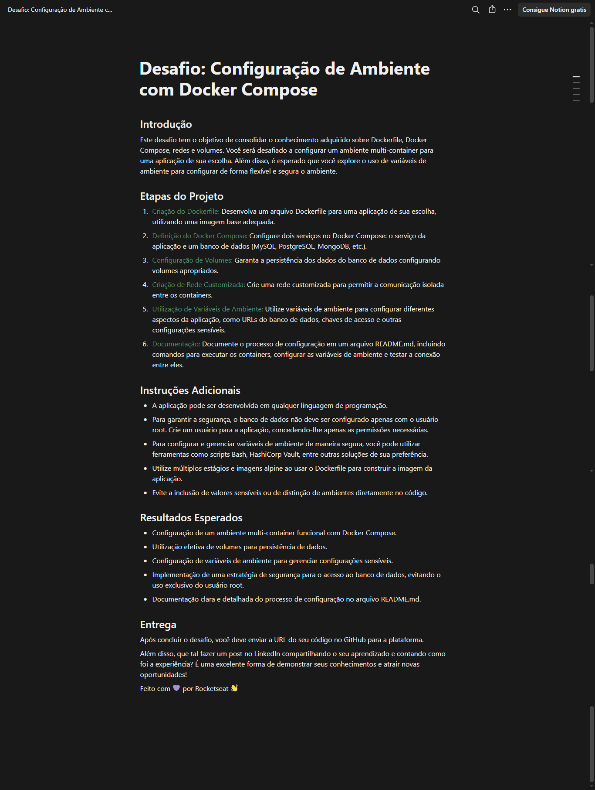
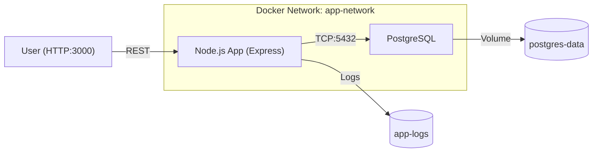

<!-- Banner & Badges -->
<h1 align="center">🚀 Rocketseat DevOps Challenge · Docker Compose Secure</h1>
<p align="center"><em>A production-ready, secure multi-container environment for Node.js & PostgreSQL using Docker Compose.</em></p>

<p align="center">
  
  
  
  
  
</p>

<p align="center">
  
</p>

---

> **ℹ️ Note for Windows users:**  
> You **do NOT need to run `chmod`** (it's not available in PowerShell/CMD)!  
> Just save all `.sh` files (especially `init-db.sh`) as plain text files with LF (Unix) line endings in VSCode, Notepad++, or similar.  
> Docker will correctly execute the script inside the Linux container.  
> On Linux/macOS, follow the standard README instructions.

---

# 🐳 Docker Compose Environment Setup

<em>An extensively documented, secure, and scalable multi-container environment with Node.js and PostgreSQL using Docker Compose — perfect for local development, study, or production deployment.</em>

---

## ✨ Features

- 🐳 **Multi-container Docker Compose** with Node.js and PostgreSQL
- 🔒 **Enhanced Security:** separate admin/app DB users, isolated privileges
- 📦 **Multi-stage Docker builds** (Alpine Linux base, minimal/non-root)
- 🔐 **Dual secrets management:** env vars + Docker secrets (auto fallback)
- 💾 **Persistent volumes** for database and log data
- 🌐 **Custom Docker network** with dedicated subnet and internal DNS
- 🩺 **Comprehensive health checks**
- 🔧 **Development hot reload and debug** via override config
- 📚 **Full documentation** on setup, secrets, CI/backup, troubleshooting, and production tips

---

## 🗂️ Project Structure

```text
project/
├── app/
│   ├── src/
│   │   └── index.js
│   ├── package.json
│   ├── Dockerfile
│   └── .dockerignore
├── docker-compose.yml
├── docker-compose.override.yml
├── .env.example
├── init-db.sh
├── secrets/
│   ├── db_app_password.txt
│   ├── db_admin_password.txt
│   └── app_secret.txt
└── README.md
```

---

## ⚡️ Quick Start

### 1️⃣ Clone and Setup
```bash
git clone <repository-url>
cd project
cp .env.example .env
mkdir -p secrets
```

### 2️⃣ Configure Secrets

#### 🅰️ Docker Secrets Files (**recommended for production**)
```bash
echo "YourStrongAdminPassword123!" > secrets/db_admin_password.txt
echo "YourStrongAppPassword456!" > secrets/db_app_password.txt
echo "YourJWTSecretKeyHere!" > secrets/app_secret.txt
# (Linux/macOS only) chmod 600 secrets/*.txt
```
> **Note:** On Windows, do NOT run `chmod`. Just make sure your secrets contain no extra line breaks.

#### 🅱️ Environment Variables (**for development**)
Edit `.env` and uncomment:
```env
DB_PASSWORD=your_admin_password
APP_SECRET=your_app_secret
```

### 3️⃣ Build and Run

For **development** (with hot reload, override):  
```bash
docker-compose up -d --build
docker-compose logs -f
docker-compose ps
```

For **production only** (main configuration only):
```bash
docker-compose -f docker-compose.yml up -d --build
```

### 4️⃣ Verify Installation
```bash
curl http://localhost:3000
curl http://localhost:3000/health
docker-compose exec postgres pg_isready -U adminuser
```

---

## 🧩 Environment Configuration

### Primary Configuration (`.env`)

| Variable         | Description                    | Default    |
|------------------|-------------------------------|------------|
| NODE_ENV         | Application environment        | production |
| APP_PORT         | Application port               | 3000       |
| DB_NAME          | Database name                  | appdb      |
| ADMIN_DB_USER    | Database admin user            | adminuser  |
| APP_DB_USER      | Application DB user            | appuser    |
| DB_PORT          | Internal database port         | 5432       |
| DB_EXPOSE_PORT   | External database port         | 5432       |

### Secret Management Options

| Level      | How             | Example                                   |
|------------|-----------------|-------------------------------------------|
| Docker     | secrets files   | `secrets/db_admin_password.txt`           |
| Env (dev)  | .env vars       | `DB_PASSWORD=...`                         |
| Advanced   | Vault/Cloud     | AWS SM, Azure KV, HashiCorp Vault, Swarm  |

#### Example (`docker-compose.yml`):
```yaml
secrets:
  db_admin_password:
    file: secrets/db_admin_password.txt
```

---

## 🧑‍💻 Development & Hot Reload

- Uses `docker-compose.override.yml` for:
  - Read-write code mount and hot-reload via nodemon
  - Exposes debug port (`9229`)
- All config/fallback works out of the box

```bash
docker-compose up -d
docker-compose logs -f app
# App reloads on code change (in dev)
```

---

## 🔒 Security Features

### PostgreSQL

- 🧑‍🎓 **Distinct admin/app DB users** (least-privilege)
- 📚 **Schema isolation:** only app user can access `app_schema`
- 🔐 **Restricted GRANTs** & revoked `PUBLIC`
- 🔑 **SCRAM-SHA-256** authentication

### Docker

- 🤖 **Non-root** containers (Node and DB)
- 📚 **Read-only** code mount (except override/dev)
- 🌐 **Custom network** (`app-network`, fixed subnet)
- 💾 **Persistent volumes**
- 🩺 **Healthchecks** on app & database
- 💪 **Resource limits** configurable

---

## 📦 Production Deployment

```bash
mkdir -p secrets
echo $(openssl rand -base64 32) > secrets/db_admin_password.txt
echo $(openssl rand -base64 32) > secrets/db_app_password.txt
echo $(openssl rand -base64 64) > secrets/app_secret.txt
# (Linux/macOS only) chmod 600 secrets/*.txt
echo "NODE_ENV=production" > .env
docker-compose -f docker-compose.yml up -d --build
```

---

## 🧑‍🔬 Advanced: Backup, Restore, Maintenance

### 🗃️ Backup
```bash
docker-compose exec postgres pg_dump -U adminuser appdb > backup_$(date +%Y%m%d).sql
```
### ♻️ Restore
```bash
cat backup.sql | docker-compose exec -T postgres psql -U adminuser appdb
```
### 🚿 Reset Dev Environment (**Wipes data!**)
```bash
docker-compose down -v
docker-compose up -d
```

---

## 🧑‍🔧 Commands Reference

| Task                | Command                                                         |
|---------------------|-----------------------------------------------------------------|
| Start               | `docker-compose up -d`                                          |
| Stop                | `docker-compose down`                                           |
| Stop + clean        | `docker-compose down -v`                                        |
| Stop + volume + images| `docker-compose down -v --rmi all`                            |
| Build               | `docker-compose build --no-cache`                               |
| Status              | `docker-compose ps`                                             |
| Logs (all/app)      | `docker-compose logs -f [app|postgres]`                         |
| PSQL shell          | `docker-compose exec postgres psql -U adminuser -d appdb`       |
| Exec in app         | `docker-compose exec app sh`                                    |
| Resource stats      | `docker-compose stats`                                          |
| Backup/Restore      | _see section above_                                             |

---

## 🩺 Troubleshooting

> 💡 **Tip:** Always check logs, permissions, and service status first!

### Common Issues

| Issue                 | How to Diagnose & Solve                                                            |
|-----------------------|------------------------------------------------------------------------------------|
| **DB Connection**     | `docker-compose logs postgres` → `exec postgres pg_isready -U adminuser`           |
| **App Not Starting**  | `docker-compose logs app`, check `/health`, restart if needed                     |
| **Permissions**       | On Windows: ignore `chmod 600`/`ls -la`. On Linux/macOS: follow instructions.      |
| **Port in use**       | `sudo lsof -i :3000` or `:5432` \| change ports in `.env` if needed                |
| **Debug Mode**        | `docker-compose up` (foreground), `docker-compose logs --tail=100 -f`              |
| **Container details** | `docker inspect $(docker-compose ps -q app)`                                       |

---

## 🔐 Advanced Configuration

### Resource Limits
Add to `docker-compose.yml`:

```yaml
services:
  app:
    deploy:
      resources:
        limits:
          cpus: '0.50'
          memory: 512M
        reservations:
          cpus: '0.25'
          memory: 256M
```

### SSL/TLS Configuration
Example in `docker-compose.yml`:
```yaml
services:
  app:
    ports:
      - "443:3000"
    environment:
      - SSL_CERT=/path/to/cert.pem
      - SSL_KEY=/path/to/key.pem
```

### Monitoring & Metrics
Add Prometheus & Grafana for metrics:
```yaml
services:
  prometheus:
    image: prom/prometheus
    ports:
      - "9090:9090"
  grafana:
    image: grafana/grafana
    ports:
      - "3001:3000"
```

---

## 📈 Maintenance Schedule

| Frequency   | Task                            |
|-------------|---------------------------------|
| Weekly      | Check for image updates         |
| Monthly     | Apply security patches          |
| Quarterly   | Test backup restoration         |
| Annually    | Review infra, scale, security   |

---

## 🛡 Best Practices Checklist

- [x] Use strong, randomly generated passwords (see secrets examples)
- [x] Regularly update Node.js, PostgreSQL, and Docker base images
- [x] Store secrets outside source control (`.env`, `secrets/` in `.gitignore`)
- [x] Restrict privileges in DB: separate users, schemas, revoke `PUBLIC`
- [x] Use multi-stage builds/minimal images (Alpine)
- [x] Monitor container logs, database, and application health
- [x] Schedule database backups and regular restores
- [x] Implement resource limits for containers if needed
- [x] Scan your images regularly for vulnerabilities

---

## 📊 Project (Stack) Overview



---

## ❤️ Acknowledgements

- Inspired by [Rocketseat](https://www.rocketseat.com.br/) challenge.
- MIT License. See [`LICENSE`](LICENSE).

---

## 📞 Contact
<p>
  <a href="https://www.linkedin.com/in/pedro-solozabal/" target="_blank">
    
  </a>
  <a href="https://github.com/solozabal" target="_blank">
    
  </a>
  <a href="https://t.me/pedrosolozabal" target="_blank">
    
  </a>
</p>